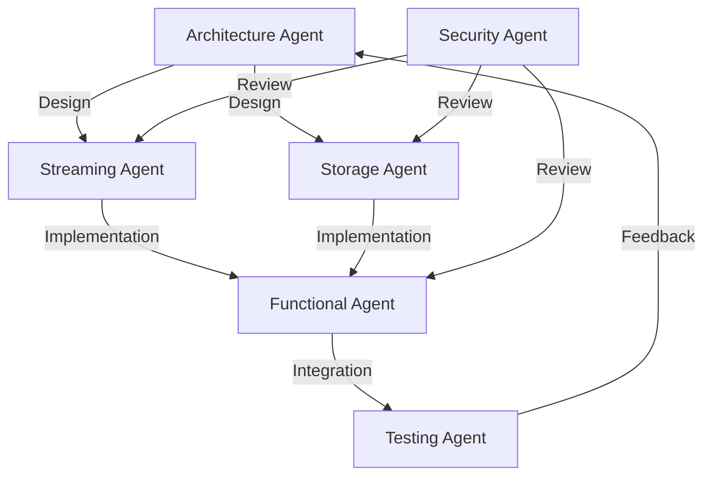

# MCP Session Manager Implementation

Orchestrates the implementation of the Session Manager component, handling Claude sessions with streaming output and checkpoint support.

## Overview

This command coordinates the implementation of Tasks 4-7: Session Manager, Output Streaming, Session Checkpoints, and Session Restoration.

## Usage

```bash
/mcp-implement-session-manager [action] [options]
```

### Actions

#### `start` - Begin implementation
```bash
/mcp-implement-session-manager start
```

Workflow sequence:
1. Architecture Agent designs session architecture
2. Streaming Agent implements JSONL parsing
3. Storage Agent designs checkpoint system
4. Functional Agent implements workflows
5. Testing Agent creates test suites

#### `design` - Create architecture design
```bash
/mcp-implement-session-manager design --component [core|streaming|checkpoint]
```

Components:
- `core`: Session lifecycle management
- `streaming`: Real-time output streaming
- `checkpoint`: Checkpoint save/restore system

#### `implement-streaming` - Implement streaming system
```bash
/mcp-implement-session-manager implement-streaming
```

JSONL Streaming Agent implements:
- Stream parser with line buffering
- Backpressure handling
- Message type detection
- Error recovery
- Performance optimization

#### `implement-checkpoints` - Implement checkpoint system
```bash
/mcp-implement-session-manager implement-checkpoints
```

Storage Agent implements:
- Content-addressable storage
- Checkpoint serialization
- Compression with Zstandard
- Atomic checkpoint operations
- Garbage collection

#### `test-integration` - Run integration tests
```bash
/mcp-implement-session-manager test-integration --scenario [streaming|checkpoint|recovery]
```

## Implementation Components

### Phase 1: Core Architecture (Architecture Agent)
```python
class SessionManager:
    """Manages Claude Code sessions with streaming and checkpoints"""
    
    def __init__(self, binary_manager: BinaryManager):
        self.binary_manager = binary_manager
        self.sessions: Dict[str, Session] = {}
        self.storage = CheckpointStorage()
        self.stream_processor = StreamProcessor()
    
    async def create_session(
        self,
        prompt: str,
        model: str = "claude-3-sonnet",
        checkpoint_id: Optional[str] = None
    ) -> Session:
        """Create or restore a session"""
        # Discover binary
        binary = await self.binary_manager.discover()
        
        # Create session
        session = Session(
            id=generate_session_id(),
            binary=binary,
            model=model
        )
        
        # Restore from checkpoint if provided
        if checkpoint_id:
            await self._restore_checkpoint(session, checkpoint_id)
        
        # Start process
        await session.start(prompt)
        
        # Begin streaming
        asyncio.create_task(
            self._stream_output(session)
        )
        
        self.sessions[session.id] = session
        return session
```

### Phase 2: Streaming Implementation (JSONL Streaming Agent)
```python
class StreamProcessor:
    """Process JSONL output streams from Claude"""
    
    def __init__(self):
        self.parser = JSONLStreamParser()
        self.message_queue = asyncio.Queue(maxsize=1000)
        
    async def process_stream(self, session: Session):
        """Process session output stream"""
        buffer = bytearray()
        
        async for chunk in session.read_output():
            buffer.extend(chunk)
            
            # Process complete lines
            while b'\n' in buffer:
                line_end = buffer.index(b'\n')
                line = bytes(buffer[:line_end])
                buffer = buffer[line_end + 1:]
                
                if line:
                    try:
                        message = json.loads(line)
                        await self._handle_message(session, message)
                    except json.JSONDecodeError as e:
                        await self._handle_error(session, e, line)
    
    async def _handle_message(self, session: Session, message: dict):
        """Handle different message types"""
        msg_type = message.get("type")
        
        if msg_type == "partial":
            # Streaming content
            await session.append_content(message["content"])
            
        elif msg_type == "response":
            # Complete response with metrics
            await session.finalize_response(message)
            
        elif msg_type == "error":
            # Error handling
            await session.handle_error(message)
            
        # Queue for MCP notifications
        await self.message_queue.put({
            "session_id": session.id,
            "message": message
        })
```

### Phase 3: Checkpoint System (Storage Agent)
```python
class CheckpointStorage:
    """Content-addressable storage for session checkpoints"""
    
    def __init__(self, storage_dir: Path):
        self.storage_dir = storage_dir
        self.db = await aiosqlite.connect(storage_dir / "checkpoints.db")
        
    async def save_checkpoint(self, session: Session) -> str:
        """Save session checkpoint"""
        # Serialize session state
        checkpoint_data = {
            "session_id": session.id,
            "model": session.model,
            "messages": session.messages,
            "context": session.context,
            "timestamp": datetime.utcnow().isoformat()
        }
        
        # Compress with Zstandard
        serialized = json.dumps(checkpoint_data).encode()
        compressed = zstd.compress(serialized, level=3)
        
        # Calculate hash
        hash_id = hashlib.sha256(compressed).hexdigest()
        
        # Store in CAS
        shard = hash_id[:2]
        path = self.storage_dir / "objects" / shard / hash_id
        path.parent.mkdir(parents=True, exist_ok=True)
        
        # Atomic write
        temp_path = path.with_suffix('.tmp')
        async with aiofiles.open(temp_path, 'wb') as f:
            await f.write(compressed)
        temp_path.rename(path)
        
        # Update database
        await self.db.execute("""
            INSERT INTO checkpoints (hash, session_id, created_at)
            VALUES (?, ?, ?)
        """, (hash_id, session.id, datetime.utcnow()))
        
        await self.db.commit()
        return hash_id
```

### Phase 4: Session Restoration (Functional Agent)
```python
async def restore_session(self, checkpoint_id: str) -> Session:
    """Restore session from checkpoint"""
    # Load checkpoint
    checkpoint = await self.storage.load_checkpoint(checkpoint_id)
    
    # Create new session
    session = Session(
        id=checkpoint["session_id"],
        model=checkpoint["model"]
    )
    
    # Restore context
    session.messages = checkpoint["messages"]
    session.context = checkpoint["context"]
    
    # Start Claude with restoration
    binary = await self.binary_manager.discover()
    
    cmd = [
        str(binary.path),
        "--resume", checkpoint_id,
        "--model", session.model,
        "--output-format", "stream-json",
        "--verbose"
    ]
    
    session.process = await asyncio.create_subprocess_exec(
        *cmd,
        stdout=subprocess.PIPE,
        stderr=subprocess.PIPE
    )
    
    return session
```

### Phase 5: Integration Testing (Testing Agent)
```python
@pytest.mark.asyncio
async def test_session_with_checkpoint():
    """Test session creation, checkpointing, and restoration"""
    manager = SessionManager(mock_binary_manager)
    
    # Create session
    session = await manager.create_session(
        prompt="Write a Python function",
        model="claude-3-sonnet"
    )
    
    # Simulate streaming
    await session.send_message("def hello_world():")
    await asyncio.sleep(0.1)
    
    # Create checkpoint
    checkpoint_id = await manager.create_checkpoint(session.id)
    assert checkpoint_id is not None
    
    # Terminate session
    await manager.terminate_session(session.id)
    
    # Restore from checkpoint
    restored = await manager.create_session(
        prompt="Continue",
        checkpoint_id=checkpoint_id
    )
    
    # Verify restoration
    assert restored.messages == session.messages
    assert restored.context == session.context
```

## Agent Coordination Flow



## Success Criteria

1. **Streaming Performance**: <10ms latency per message
2. **Checkpoint Size**: <50% of original with compression
3. **Restoration Time**: <1s for typical sessions
4. **Concurrent Sessions**: Support 100+ active sessions
5. **Error Recovery**: Graceful handling of stream interruptions
6. **Memory Usage**: Constant memory with backpressure

## Example Workflows

```bash
# Full implementation
/mcp-implement-session-manager start

# Just streaming component
/mcp-implement-session-manager implement-streaming

# Test checkpoint system
/mcp-implement-session-manager test-integration --scenario checkpoint

# Review by security team
/mcp-implement-session-manager review --focus security
```