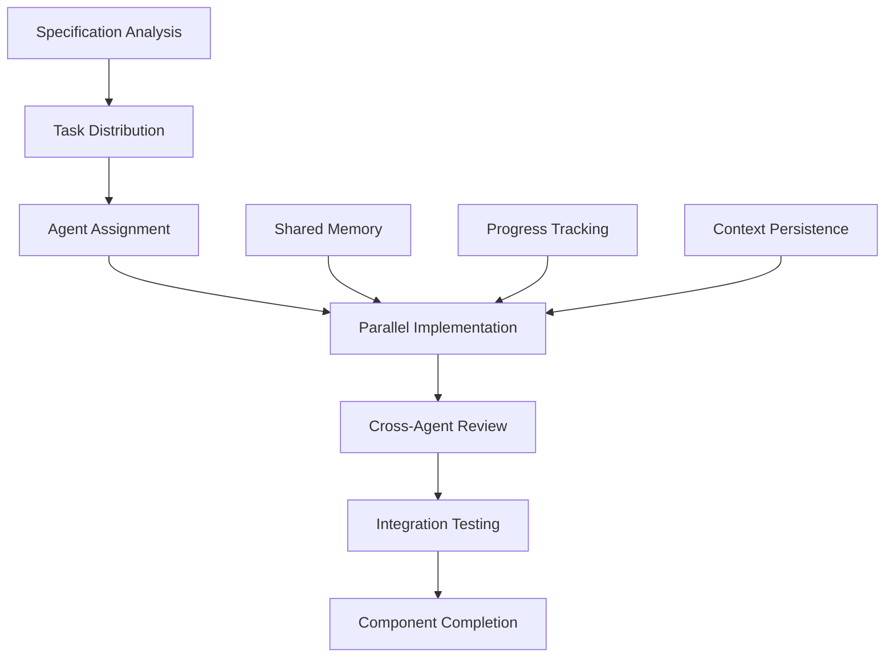

# Shannon MCP - Claude Code MCP Server

A comprehensive Model Context Protocol (MCP) server implementation for Claude Code, built using an innovative multi-agent collaborative system.

## Overview

Shannon MCP is a Python-based MCP server that provides programmatic management of Claude Code CLI operations. This project replicates and extends the functionality found in the Claude Desktop application, exposing all Claude Code interactions through standardized MCP tools.

## Multi-Agent Architecture

This project employs a revolutionary approach: **26 specialized AI agents** working collaboratively to implement the entire MCP server specification. Each agent has deep expertise in specific domains and works together through shared memory and orchestration systems.

### System Architecture

```
┌─────────────────────────────────────────────────────────────────┐
│                     ORCHESTRATION LAYER                          │
│  ┌─────────────────┐  ┌──────────────┐  ┌─────────────────┐   │
│  │ Build           │  │ Agent        │  │ Shared          │   │
│  │ Orchestrator    │  │ Progress     │  │ Memory          │   │
│  │                 │  │ Tracker      │  │ Context         │   │
│  └────────┬────────┘  └──────┬───────┘  └────────┬────────┘   │
│           │                   │                    │             │
│           └───────────────────┴────────────────────┘             │
│                              │                                   │
└──────────────────────────────┼───────────────────────────────────┘
                               │
┌──────────────────────────────┼───────────────────────────────────┐
│                        AGENT LAYER                                │
│                                                                   │
│  ┌─────────────────────────────────────────────────────────┐    │
│  │                    Core Architecture                     │    │
│  │  ┌──────────┐ ┌──────────┐ ┌──────────┐ ┌──────────┐  │    │
│  │  │Architecture│ │SDK Expert│ │Python MCP│ │Functional│  │    │
│  │  │  Agent    │ │          │ │  Expert  │ │  Server  │  │    │
│  │  └──────────┘ └──────────┘ └──────────┘ └──────────┘  │    │
│  └─────────────────────────────────────────────────────────┘    │
│                                                                   │
│  ┌─────────────────────────────────────────────────────────┐    │
│  │                    Infrastructure                        │    │
│  │  ┌──────────┐ ┌──────────┐ ┌──────────┐ ┌──────────┐  │    │
│  │  │ Database │ │Streaming │ │  JSONL   │ │ Process  │  │    │
│  │  │ Storage  │ │Concurrency│ │Streaming │ │Management│  │    │
│  │  └──────────┘ └──────────┘ └──────────┘ └──────────┘  │    │
│  └─────────────────────────────────────────────────────────┘    │
│                                                                   │
│  ┌─────────────────────────────────────────────────────────┐    │
│  │                 Specialized Agents                       │    │
│  │  ┌──────────┐ ┌──────────┐ ┌──────────┐ ┌──────────┐  │    │
│  │  │ Security │ │ Testing  │ │ DevOps   │ │Analytics │  │    │
│  │  │Validation│ │ Quality  │ │Deployment│ │Monitoring│  │    │
│  │  └──────────┘ └──────────┘ └──────────┘ └──────────┘  │    │
│  │                    + 14 more agents...                   │    │
│  └─────────────────────────────────────────────────────────┘    │
│                                                                   │
└───────────────────────────────────────────────────────────────────┘
                               │
┌──────────────────────────────┼───────────────────────────────────┐
│                    IMPLEMENTATION LAYER                           │
│                                                                   │
│  ┌─────────────────────────────────────────────────────────┐    │
│  │                  MCP Server Components                    │    │
│  │  ┌──────────┐ ┌──────────┐ ┌──────────┐ ┌──────────┐  │    │
│  │  │ Binary   │ │ Session  │ │Checkpoint│ │  Hooks   │  │    │
│  │  │ Manager  │ │ Manager  │ │ System   │ │Framework │  │    │
│  │  └──────────┘ └──────────┘ └──────────┘ └──────────┘  │    │
│  └─────────────────────────────────────────────────────────┘    │
│                                                                   │
└───────────────────────────────────────────────────────────────────┘
```

### Agent Categories

#### 1. Core Architecture Agents (4)
- **Architecture Agent**: System design and architectural decisions
- **Claude Code SDK Expert**: Deep knowledge of Claude Code CLI and SDK
- **Python MCP Server Expert**: MCP protocol implementation specialist
- **Functional MCP Server**: Business logic and feature implementation

#### 2. Infrastructure Agents (7)
- **Database Storage**: SQLite optimization and content-addressable storage
- **Streaming Concurrency**: Async patterns and stream processing
- **JSONL Streaming**: Real-time JSONL parsing and handling
- **Process Management**: System process monitoring
- **Filesystem Monitor**: Real-time file system change detection
- **Platform Compatibility**: Cross-platform support
- **Storage Algorithms**: Content-addressable storage optimization

#### 3. Quality & Security Agents (6)
- **Security Validation**: Input validation and security implementation
- **Testing Quality**: Comprehensive test implementation
- **Error Handling**: Error recovery and user-friendly messages
- **Performance Optimizer**: Performance profiling and optimization
- **Documentation**: Technical documentation and examples
- **DevOps Deployment**: CI/CD and deployment automation

#### 4. Specialized Agents (9)
- **Telemetry OpenTelemetry**: Observability implementation
- **Analytics Monitoring**: Usage analytics and reporting
- **Integration Specialist**: Third-party integrations
- **Project Coordinator**: Overall project management
- **Migration Specialist**: Database and config migrations
- **SSE Transport**: Server-Sent Events implementation
- **Resources Specialist**: MCP resource exposure
- **Prompts Engineer**: MCP prompt templates
- **Plugin Architect**: Plugin system design

## How It Works

### 1. Orchestration Layer

The orchestration layer coordinates all agent activities through specialized commands:

- **`/mcp-build-orchestrator`**: Master command that distributes tasks to agents
- **`/mcp-agent-progress`**: Tracks real-time progress of all agents
- **`/mcp-shared-memory`**: Enables knowledge sharing between agents
- **`/mcp-agent-context`**: Manages persistent context for each agent

### 2. Agent Collaboration

Agents collaborate through several mechanisms:

```
┌─────────────────┐     ┌─────────────────┐     ┌─────────────────┐
│   Agent A       │     │ Shared Memory   │     │   Agent B       │
│                 │────▶│                 │◀────│                 │
│ Discovers       │     │ Stores Pattern  │     │ Uses Pattern    │
│ Pattern         │     │                 │     │                 │
└─────────────────┘     └─────────────────┘     └─────────────────┘
                               │
                               ▼
                    ┌─────────────────────┐
                    │ Knowledge Graph     │
                    │ Semantic Search     │
                    │ Pattern Evolution   │
                    └─────────────────────┘
```

### 3. Implementation Workflow



## Building Process

The building process follows these phases:

### Phase 1: Core Infrastructure (25 tasks)
- Project setup and MCP server foundation
- Binary Manager implementation
- Session Manager with streaming
- Basic error handling

### Phase 2: Advanced Features (25 tasks)
- Agent system implementation
- MCP server management
- Checkpoint system with CAS
- Hooks framework

### Phase 3: Analytics & Monitoring (15 tasks)
- Analytics engine
- Process registry
- Settings management

### Phase 4: Testing & Documentation (10 tasks)
- Integration testing
- API documentation
- Usage examples

### Phase 5: Production Readiness (10 tasks)
- Performance optimization
- Security hardening
- Deployment pipeline

### Phase 6: Advanced Integration (10 tasks)
- Claude Desktop integration
- Cloud features
- Enterprise capabilities

## Key Features

### 1. Binary Management
- Automatic Claude Code discovery
- Version detection and validation
- Multi-method search (PATH, NVM, standard locations)

### 2. Session Orchestration
- Real-time JSONL streaming
- Full process lifecycle management
- Cancellation and cleanup

### 3. Agent System
- Custom AI agents with specialized prompts
- Background execution tracking
- GitHub import capabilities

### 4. Checkpoint System
- Git-like versioning for sessions
- Content-addressable storage
- Branching and restoration

### 5. Hooks Framework
- Event-driven automation
- Command execution on Claude events
- Flexible configuration

## Getting Started

1. **Prerequisites**
   - Python 3.11+
   - Claude Code CLI installed
   - 100MB disk space

2. **Agent System Activation**
   ```bash
   # The agents are already installed in ~/.claude/
   # Activate the system
   python ~/.claude/activate-mcp-system.py
   ```

3. **Initialize Build Process**
   ```bash
   # Use the orchestrator to start building
   /mcp-build-orchestrator init --project-path ~/shannon-mcp
   ```

4. **Monitor Progress**
   ```bash
   # Check agent progress
   /mcp-agent-progress status --detailed
   ```

## Technical Stack

- **Language**: Python 3.11+
- **Async Framework**: asyncio
- **MCP SDK**: FastMCP pattern
- **Storage**: SQLite with aiosqlite
- **Compression**: Zstandard
- **Streaming**: JSONL with backpressure handling

## Development Workflow

1. Agents analyze the specification
2. Tasks are distributed based on expertise
3. Implementation happens in parallel
4. Cross-agent reviews ensure quality
5. Integration testing validates components
6. Documentation is generated automatically

## Contributing

This project is built by AI agents, but human contributions are welcome for:
- Bug reports and feature requests
- Testing and validation
- Documentation improvements
- Integration examples

## License

MIT License - See LICENSE file for details

## Acknowledgments

- Built using Claude Code's multi-agent capabilities
- Based on the Model Context Protocol specification
- Inspired by collaborative AI development patterns

---

*This project demonstrates the future of software development: specialized AI agents working together to build complex systems with minimal human intervention.*