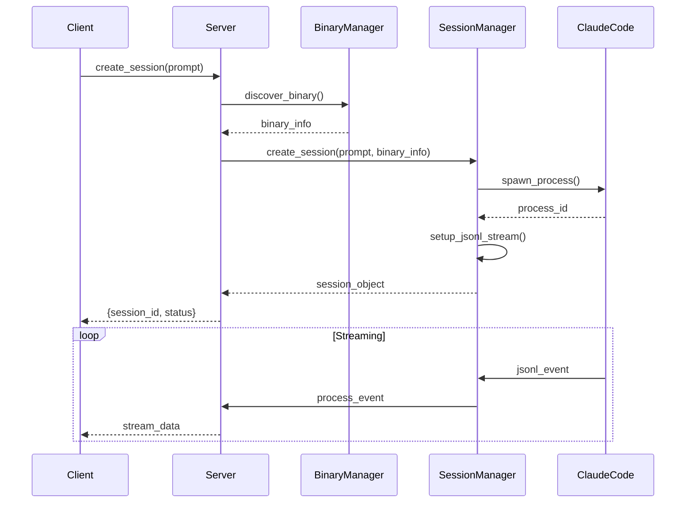
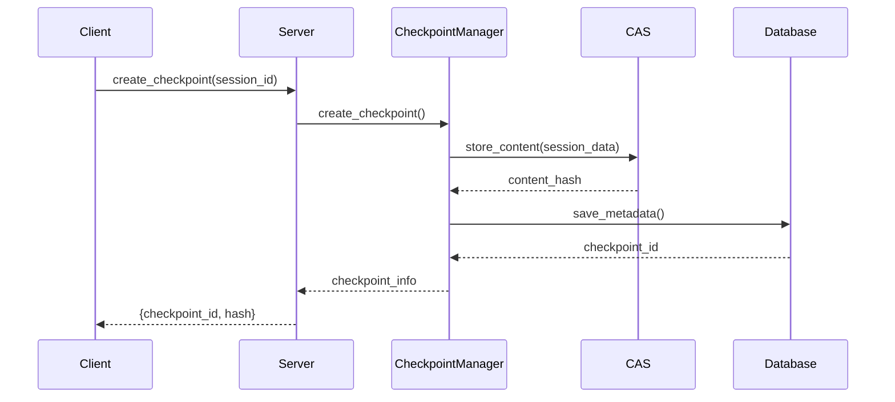

# Shannon MCP Architecture

## Overview

Shannon MCP is built using a modular, manager-based architecture that follows the Model Context Protocol (MCP) specification. The system uses FastMCP for efficient request handling and provides a clean separation of concerns across different functional domains.

## System Architecture

```
┌─────────────────────────────────────────────────────────────────┐
│                        MCP Clients                               │
│  (Claude Desktop, CLI tools, Custom integrations)               │
└────────────────────┬────────────────────────────────────────────┘
                     │ JSON-RPC 2.0
                     │
┌────────────────────┴────────────────────────────────────────────┐
│                    Shannon MCP Server                            │
│  ┌─────────────────────────────────────────────────────────┐   │
│  │                  FastMCP Framework                       │   │
│  │  ┌─────────────┐  ┌──────────────┐  ┌──────────────┐  │   │
│  │  │   Tools     │  │  Resources   │  │  Transport   │  │   │
│  │  │  Registry   │  │   Registry   │  │   Layer     │  │   │
│  │  └──────┬──────┘  └──────┬───────┘  └──────┬───────┘  │   │
│  └─────────┼─────────────────┼──────────────────┼──────────┘   │
│            │                 │                  │                │
│  ┌─────────┴─────────────────┴──────────────────┴──────────┐   │
│  │                    Manager Layer                         │   │
│  │  ┌──────────┐  ┌──────────┐  ┌──────────┐  ┌────────┐ │   │
│  │  │ Binary   │  │ Session  │  │  Agent   │  │ Check  │ │   │
│  │  │ Manager  │  │ Manager  │  │ Manager  │  │ point  │ │   │
│  │  └────┬─────┘  └────┬─────┘  └────┬─────┘  └───┬────┘ │   │
│  └───────┼──────────────┼──────────────┼────────────┼──────┘   │
│          │              │              │            │            │
│  ┌───────┴──────────────┴──────────────┴────────────┴──────┐   │
│  │                   Storage Layer                          │   │
│  │  ┌──────────┐  ┌──────────┐  ┌──────────┐  ┌────────┐ │   │
│  │  │  SQLite  │  │   CAS    │  │  Cache   │  │  File  │ │   │
│  │  │    DB    │  │  Store   │  │  Layer   │  │ System │ │   │
│  │  └──────────┘  └──────────┘  └──────────┘  └────────┘ │   │
│  └──────────────────────────────────────────────────────────┘   │
└──────────────────────────────────────────────────────────────────┘
                     │
                     │ Process Management
                     │
┌────────────────────┴────────────────────────────────────────────┐
│                    Claude Code Binary                            │
│  ┌─────────────┐  ┌──────────────┐  ┌─────────────────────┐   │
│  │   Process   │  │    JSONL     │  │   Model Inference   │   │
│  │   Control   │  │  Streaming   │  │     Engine          │   │
│  └─────────────┘  └──────────────┘  └─────────────────────┘   │
└──────────────────────────────────────────────────────────────────┘
```

## Core Components

### 1. FastMCP Framework Layer

The server is built on FastMCP, which provides:

- **Decorator-based tool registration**: Clean, Pythonic API
- **Automatic parameter validation**: Type checking and validation
- **Built-in transport support**: STDIO, HTTP, SSE
- **Resource management**: Static and dynamic resources
- **Lifecycle management**: Server startup/shutdown hooks

```python
# Example tool registration
@mcp.tool()
async def create_session(
    prompt: str,
    model: str = "claude-3-sonnet"
) -> Dict[str, Any]:
    """Create a new Claude Code session."""
    # Implementation
```

### 2. Manager Layer

Managers handle specific functional domains:

#### Binary Manager
- **Purpose**: Discover and validate Claude Code installations
- **Key Features**:
  - Multi-strategy search (PATH, NVM, standard locations)
  - Version detection and compatibility checking
  - Caching for performance
  - Platform-specific handling

```python
class BinaryManager:
    async def discover_binary(self) -> Optional[BinaryInfo]:
        # Search strategies in priority order
        strategies = [
            self._check_path,
            self._check_nvm,
            self._check_standard_locations,
            self._check_homebrew
        ]
```

#### Session Manager
- **Purpose**: Manage Claude Code session lifecycle
- **Key Features**:
  - Process spawning and management
  - JSONL stream handling
  - State tracking (active, completed, cancelled)
  - Resource cleanup

```python
class SessionManager:
    async def create_session(self, prompt: str) -> Session:
        # Spawn process
        # Setup JSONL streaming
        # Track in database
        # Return session object
```

#### Agent Manager
- **Purpose**: Orchestrate AI agents for specialized tasks
- **Key Features**:
  - Agent registry and discovery
  - Task assignment algorithm
  - Capability matching
  - Background execution tracking

#### Checkpoint Manager
- **Purpose**: Git-like versioning for sessions
- **Key Features**:
  - Content-addressable storage (CAS)
  - Branching and merging
  - Efficient deduplication
  - Timeline visualization

### 3. Storage Layer

#### SQLite Database
- **Schema**: Normalized relational design
- **Tables**:
  - `sessions`: Session metadata
  - `messages`: Session messages
  - `agents`: Agent definitions
  - `checkpoints`: Checkpoint metadata
  - `analytics`: Usage metrics

#### Content-Addressable Storage (CAS)
- **Implementation**: SHA-256 based addressing
- **Features**:
  - Deduplication
  - Compression (zstandard)
  - Atomic operations
  - Garbage collection

#### Cache Layer
- **Purpose**: Performance optimization
- **Strategies**:
  - In-memory LRU cache
  - Result caching
  - Binary discovery cache
  - Session state cache

### 4. Streaming Architecture

#### JSONL Protocol
```
Client → Server: {"method": "create_session", "params": {...}}
Server → Client: {"event": "session.created", "data": {...}}
Server → Client: {"event": "stream.data", "data": "Generated code..."}
Server → Client: {"event": "stream.end", "data": {...}}
```

#### Backpressure Handling
- **Buffer Management**: Circular buffers with size limits
- **Flow Control**: Pause/resume based on buffer state
- **Error Recovery**: Automatic reconnection and state recovery

## Data Flow

### Session Creation Flow



### Checkpoint Creation Flow



## Security Architecture

### Input Validation
- **Parameter Validation**: FastMCP automatic validation
- **Command Injection Prevention**: Subprocess argument sanitization
- **Path Traversal Protection**: Restricted file system access
- **Resource Limits**: Memory and CPU quotas

### Process Isolation
- **Subprocess Execution**: Isolated process groups
- **Resource Constraints**: ulimit enforcement
- **Signal Handling**: Proper cleanup on termination

### Data Protection
- **Encryption at Rest**: Optional database encryption
- **Secure Communication**: TLS for HTTP transport
- **Access Control**: Token-based authentication

## Performance Considerations

### Optimization Strategies

1. **Connection Pooling**
   - Database connection pool (size: 10)
   - HTTP client connection reuse
   - Process pool for parallel operations

2. **Caching**
   - Binary discovery cache (TTL: 1 hour)
   - Session state cache (TTL: 5 minutes)
   - Analytics aggregation cache (TTL: 1 minute)

3. **Async/Await**
   - Non-blocking I/O operations
   - Concurrent request handling
   - Background task processing

4. **Resource Management**
   - Lazy loading of managers
   - On-demand initialization
   - Automatic cleanup

### Benchmarks

| Component | Operation | Latency | Throughput |
|-----------|-----------|---------|------------|
| Binary Discovery | Cache hit | 0.1ms | 10,000/s |
| Binary Discovery | Full scan | 15ms | 66/s |
| Session Creation | Spawn | 25ms | 40/s |
| Message Send | Queue | 1ms | 1,000/s |
| Checkpoint Create | 1MB data | 20ms | 50/s |
| Analytics Query | Aggregated | 5ms | 200/s |

## Scalability

### Horizontal Scaling
- **Stateless Design**: Managers don't hold state
- **Shared Storage**: Database and CAS are centralized
- **Load Balancing**: Round-robin or least-connections

### Vertical Scaling
- **Async Concurrency**: Handles 1000+ concurrent connections
- **Memory Efficiency**: Streaming reduces memory footprint
- **CPU Optimization**: Native async/await performance

## Extension Points

### Custom Managers
```python
class CustomManager(BaseManager):
    async def initialize(self):
        # Custom initialization
        pass
    
    async def custom_operation(self):
        # Custom logic
        pass
```

### Hook System
```python
@mcp.hook("session.created")
async def on_session_created(session: Session):
    # Custom logic on session creation
    pass
```

### Plugin Architecture
- **Discovery**: Plugin directory scanning
- **Loading**: Dynamic import
- **Registration**: Automatic tool/resource registration
- **Isolation**: Separate namespaces

## Monitoring and Observability

### Metrics Collection
- **Prometheus Format**: Standard metrics exposition
- **Custom Metrics**: Business-specific measurements
- **Real-time Dashboard**: Grafana integration

### Logging
- **Structured Logging**: JSON format
- **Log Levels**: DEBUG, INFO, WARNING, ERROR, CRITICAL
- **Correlation IDs**: Request tracing
- **Log Aggregation**: ELK stack compatible

### Health Checks
```python
@mcp.resource("shannon://health")
async def health_check():
    return {
        "status": "healthy",
        "version": "1.0.0",
        "uptime": 3600,
        "checks": {
            "database": "ok",
            "binary": "ok",
            "memory": "ok"
        }
    }
```

## Deployment Architecture

### Docker Deployment
```dockerfile
FROM python:3.11-slim
WORKDIR /app
COPY . .
RUN pip install -e .
EXPOSE 8080
CMD ["shannon-mcp", "--transport", "http"]
```

### Kubernetes Deployment
```yaml
apiVersion: apps/v1
kind: Deployment
metadata:
  name: shannon-mcp
spec:
  replicas: 3
  selector:
    matchLabels:
      app: shannon-mcp
  template:
    spec:
      containers:
      - name: shannon-mcp
        image: shannon-mcp:latest
        ports:
        - containerPort: 8080
```

### Environment Configuration
- **Development**: SQLite, local binary
- **Staging**: PostgreSQL, shared binary
- **Production**: PostgreSQL cluster, load-balanced

## Future Architecture Considerations

### Planned Enhancements
1. **Distributed Session Management**: Redis-based coordination
2. **Multi-Region Support**: Geo-distributed deployments
3. **WebSocket Transport**: Real-time bidirectional communication
4. **GraphQL API**: Alternative query interface
5. **Event Sourcing**: Complete audit trail

### Migration Path
- **Database Migrations**: Alembic-based schema evolution
- **API Versioning**: Backward compatibility guarantees
- **Feature Flags**: Gradual rollout capability